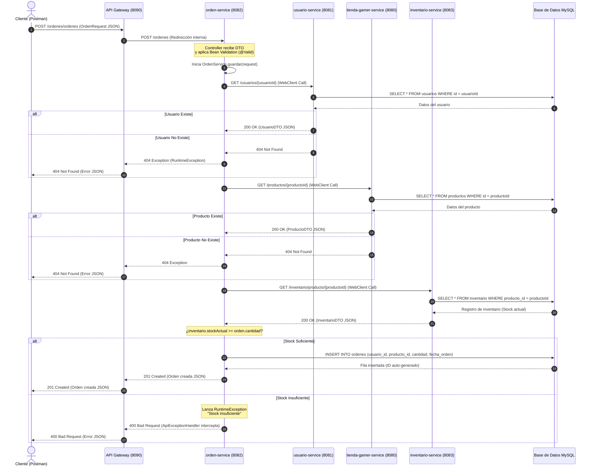
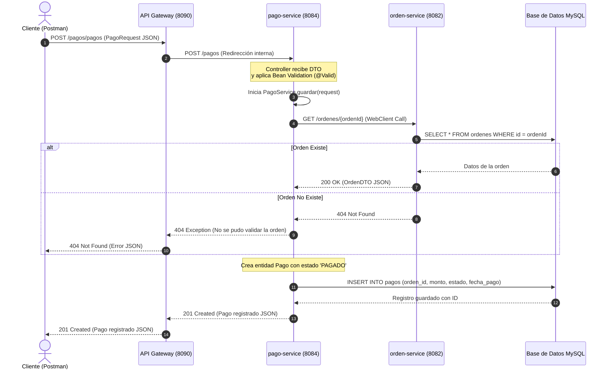
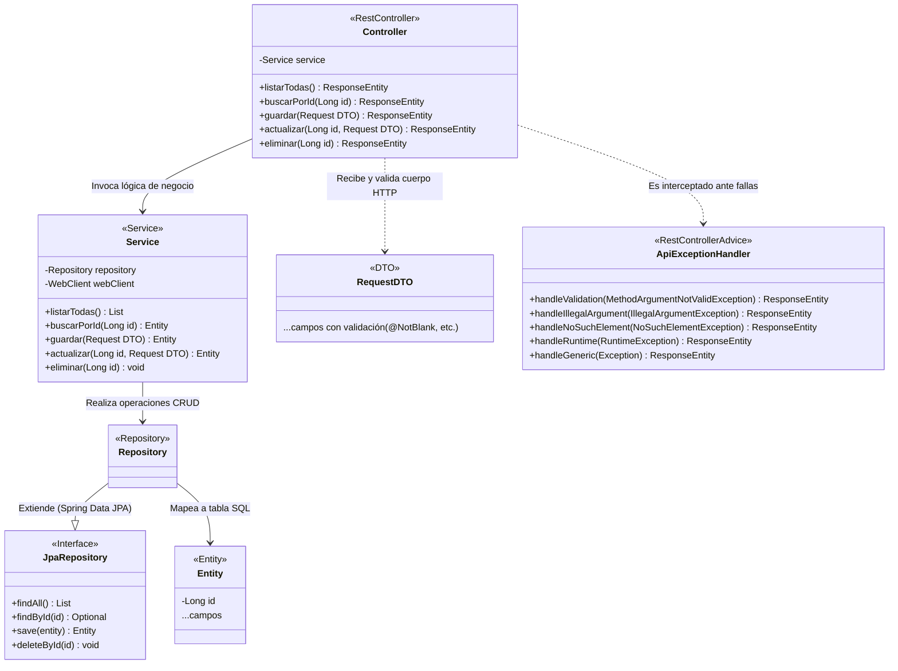
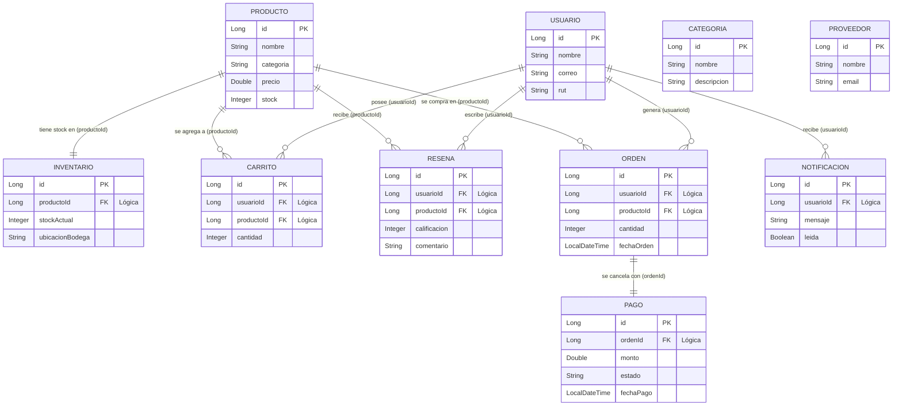

# Guía de Documentación Completa y Defensa Técnica: Tienda Gamer (EFT)

Esta documentación está diseñada para servir como **guía de estudio y material de defensa técnica** para el Examen Final Transversal (EFT) de la asignatura **Desarrollo FullStack 1** (DSY1103). Aquí se explica en detalle qué hace el sistema, cómo está estructurado, cómo se relacionan sus partes y cómo responder con éxito ante las preguntas del docente o las solicitudes de modificación de código en vivo.

---

## 1. Visión General del Proyecto

El sistema es una **plataforma distribuida de comercio electrónico (E-Commerce) enfocada en una Tienda Gamer**. Permite gestionar el ciclo de vida completo de una venta: administración de usuarios, catálogo de productos clasificados por categorías, gestión de stock en bodega, procesamiento de carritos de compras, generación de órdenes de compra, validación de pagos, envío de notificaciones y publicación de reseñas de productos.

### Arquitectura de Microservicios
La solución adopta una **arquitectura descentralizada** basada en microservicios independientes y autónomos que se comunican de forma síncrona mediante protocolos HTTP/REST:
* **Autonomía:** Cada microservicio es un proyecto Spring Boot independiente con su propia base de datos, lo que evita el acoplamiento y permite escalabilidad individual.
* **Service Registry (Eureka):** Centraliza el registro y descubrimiento dinámico de todas las instancias de los servicios.
* **API Gateway:** Actúa como punto de entrada único para el cliente, centralizando el enrutamiento hacia las instancias de los microservicios correspondientes y ocultando la complejidad de la topología interna.
* **Bases de Datos:** Se implementa el patrón **Database per Service** utilizando un contenedor MySQL único que hospeda esquemas independientes para cada servicio, garantizando la cohesión de los datos.

---

## 2. Mapa de Componentes y Puertos

El ecosistema está compuesto por **12 servicios en total**: 2 servicios de infraestructura (Eureka y API Gateway) y 10 microservicios de negocio.

| Servicio | Puerto Local | Context-Path / Ruta Gateway | Base de Datos (MySQL) | Descripción |
| :--- | :---: | :--- | :--- | :--- |
| **eureka-server** | `8761` | `/` | *N/A* | Servidor de registro y descubrimiento de servicios. |
| **api-gateway** | `8090` | `/` | *N/A* | Puerta de enlace unificada que redirige el tráfico REST. |
| **tienda-gamer-service** | `8080` | `/productos/**` | `db_tienda_gamer` | Gestión de catálogo de productos (creación, edición, stock). |
| **usuario-service** | `8081` | `/usuarios/**` | `db_usuarios` | Registro, modificación y validación de usuarios y roles. |
| **orden-service** | `8082` | `/ordenes/**` | `db_ordenes` | Orquestación de compras (valida usuario, producto y stock). |
| **inventario-service** | `8083` | `/inventario/**` | `db_inventario` | Control de stock físico y ubicación en bodegas. |
| **pago-service** | `8084` | `/pagos/**` | `db_pagos` | Registro y validación del estado de pagos de una orden. |
| **categoria-service** | `8085` | `/categorias/**` | `db_categorias` | Clasificación y agrupación lógica de productos. |
| **proveedor-service** | `8086` | `/proveedores/**` | `db_proveedores` | Registro y control de los proveedores de mercancía gamer. |
| **carrito-service** | `8087` | `/carritos/**` | `db_carritos` | Persistencia temporal de productos seleccionados por un usuario. |
| **resena-service** | `8088` | `/resenas/**` | `db_resenas` | Calificaciones (1-5 estrellas) y comentarios sobre productos. |
| **notificacion-service** | `8089` | `/notificaciones/**` | `db_notificaciones` | Registro y despacho de alertas o correos informativos. |

---

## 3. Diagramas UML

### A. Diagrama de Arquitectura del Sistema
Este diagrama ilustra el flujo de peticiones desde el cliente externo (Postman o navegador) a través del API Gateway, el rol del servidor Eureka para el registro y el flujo de comunicación síncrona mediante `WebClient`.

```mermaid
graph TD
    Client["Cliente (Postman / Web UI)"] -->|Solicitud HTTP (Puerto 8090)| Gateway["API Gateway (api-gateway:8090)"]
    
    subgraph Discovery
        Eureka["Eureka Server (eureka-server:8761)"]
    end
    
    subgraph Servicios Core
        US["usuario-service (8081)"]
        PS["tienda-gamer-service (8080)"]
        IS["inventario-service (8083)"]
        OS["orden-service (8082)"]
        PaS["pago-service (8084)"]
    end

    subgraph Servicios Secundarios
        CS["categoria-service (8085)"]
        ProvS["proveedor-service (8086)"]
        CarS["carrito-service (8087)"]
        RS["resena-service (8088)"]
        NS["notificacion-service (8089)"]
    end

    %% Registro en Eureka
    Gateway -.->|Descubrimiento| Eureka
    US -.->|Registro| Eureka
    PS -.->|Registro| Eureka
    IS -.->|Registro| Eureka
    OS -.->|Registro| Eureka
    PaS -.->|Registro| Eureka
    CS -.->|Registro| Eureka
    ProvS -.->|Registro| Eureka
    CarS -.->|Registro| Eureka
    RS -.->|Registro| Eureka
    NS -.->|Registro| Eureka

    %% Redireccionamiento Gateway
    Gateway -->|/usuarios/**| US
    Gateway -->|/productos/**| PS
    Gateway -->|/inventario/**| IS
    Gateway -->|/ordenes/**| OS
    Gateway -->|/pagos/**| PaS
    Gateway -->|/categorias/**| CS
    Gateway -->|/proveedores/**| ProvS
    Gateway -->|/carritos/**| CarS
    Gateway -->|/resenas/**| RS
    Gateway -->|/notificaciones/**| NS

    %% Comunicación entre microservicios (WebClient)
    OS ===>|1. Valida Usuario| US
    OS ===>|2. Valida Producto| PS
    OS ===>|3. Valida y Consulta Stock| IS
    PaS ===>|Valida Orden| OS

    %% Bases de Datos
    subgraph Servidor MySQL (mysql-fullstack:3307)
        DB_U[("db_usuarios")]
        DB_T[("db_tienda_gamer")]
        DB_I[("db_inventario")]
        DB_O[("db_ordenes")]
        DB_P[("db_pagos")]
        DB_C[("db_categorias")]
        DB_PV[("db_proveedores")]
        DB_CR[("db_carritos")]
        DB_R[("db_resenas")]
        DB_N[("db_notificaciones")]
    end

    US --> DB_U
    PS --> DB_T
    IS --> DB_I
    OS --> DB_O
    PaS --> DB_P
    CS --> DB_C
    ProvS --> DB_PV
    CarS --> DB_CR
    RS --> DB_R
    NS --> DB_N
```

---

### B. Diagrama de Secuencia: Creación de una Orden de Compra
Muestra el paso a paso del flujo distribuido cuando se crea una orden (`POST /ordenes`). El servicio `orden-service` actúa como orquestador consumiendo endpoints de otros servicios usando `WebClient`.



---

### C. Diagrama de Secuencia: Registro de un Pago
Muestra cómo `pago-service` valida de manera distribuida la existencia y consistencia de una orden de compra antes de autorizar y registrar un pago.



---

### D. Diagrama de Clases: Estructura del Patrón CSR (Controller-Service-Repository)
Todos los microservicios del proyecto respetan una estructura limpia y desacoplada mediante capas bien definidas. El siguiente diagrama detalla cómo interactúan las clases dentro de un microservicio modelo.



---

### E. Modelo de Datos Relacional Conceptual
Dado que implementamos la arquitectura de microservicios con **Database per Service**, físicamente existen 10 bases de datos separadas (aisladas). Sin embargo, a nivel conceptual, los datos se relacionan mediante claves lógicas (`usuarioId`, `productoId`, `ordenId`), preservando la integridad a nivel de aplicación en lugar de llaves foráneas duras a nivel de base de datos.



---

## 4. Explicación de Conceptos Clave y Patrones

### A. Patrón CSR (Controller-Service-Repository)
* **Controller (Capa de Presentación/Entrada):** Clase anotada con `@RestController`. Su única responsabilidad es exponer los endpoints HTTP de la API, recibir las solicitudes, validar los datos de entrada (a través de `@Valid` y DTOs) y estructurar las respuestas REST utilizando `ResponseEntity` con códigos HTTP semánticos (200, 201, 400, 404, 500). **No contiene lógica de negocio**.
* **Service (Capa de Lógica de Negocio):** Clase anotada con `@Service`. Contiene las reglas del negocio, validaciones lógicas complejas (como verificar que haya suficiente stock en bodega) e invoca las consultas al repositorio. Es el puente entre el controlador y la base de datos.
* **Repository (Capa de Acceso a Datos):** Interfaz anotada con `@Repository` que extiende de `JpaRepository`. Permite realizar consultas SQL de forma transparente mediante métodos autogenerados por Spring Data JPA (ej: `save()`, `findById()`, `findAll()`, `deleteById()`).
* **Model (Capa de Datos/Entidades):** Clases anotadas con `@Entity` y `@Table` que representan las tablas físicas de la base de datos relacional. Utilizan Hibernate como ORM para mapear propiedades a columnas.

### B. Uso de DTOs (Data Transfer Objects)
Los DTOs se utilizan para transportar datos entre el controlador y el servicio. **No representan directamente una tabla en la base de datos**, sino el contrato o estructura del cuerpo JSON que el cliente envía o recibe.
* **Por qué se usan:**
  1. **Seguridad:** Evitan exponer columnas sensibles (como contraseñas o ids internos) que pertenecen a la Entidad JPA.
  2. **Separación de Responsabilidad:** Permiten validar datos específicos de entrada (ej: que un correo tenga formato válido) sin ensuciar la entidad de base de datos.
  3. **Flexibilidad:** Permiten acoplar estructuras complejas en una sola solicitud.
* En el proyecto se implementan utilizando Java `records` (clases inmutables compactas) en lugar de clases tradicionales, reduciendo código repetitivo (Boilerplate).

### C. Bean Validation (JSR 380) y Validación en DTOs
Permite declarar restricciones directamente en los campos del DTO usando anotaciones estándar:
* `@NotBlank`: Valida que una cadena de texto no sea nula, ni esté vacía, ni contenga solo espacios en blanco.
* `@NotNull`: Valida que un objeto o campo numérico no sea nulo.
* `@Min(value)` / `@Max(value)`: Valida que un número sea mayor/menor o igual a un límite.
* `@Email`: Valida que el texto cumpla con un patrón de correo electrónico estándar.
* **Activación:** Se coloca la anotación `@Valid` al parámetro del método del `@PostMapping` o `@PutMapping` en el Controller. Si la validación falla, Spring arroja una excepción `MethodArgumentNotValidException`.

### D. Manejo Centralizado de Excepciones (`@RestControllerAdvice`)
En lugar de llenar el código de bloques `try-catch` redundantes en los controladores, se define una clase anotada con `@RestControllerAdvice` (por ejemplo, [ApiExceptionHandler](file:///c:/Users/GLADIS/Documents/FullStack%20Prueba%203/usuario-service/src/main/java/cl/duoc/tienda/usuario/exception/ApiExceptionHandler.java)):
* Actúa como un **interceptor global** de excepciones.
* Cada método dentro de esta clase se anota con `@ExceptionHandler(ClaseExcepcion.class)`.
* Captura errores como `MethodArgumentNotValidException` (errores de DTO), `IllegalArgumentException` (datos inválidos en el servicio) o `NoSuchElementException` (recursos no encontrados).
* Retorna un cuerpo JSON estructurado uniforme ante cualquier falla (por ejemplo, con propiedades como `timestamp`, `status`, `error` y `message`) y el correspondiente código de estado HTTP (400 Bad Request, 404 Not Found, etc.). Esto previene que se expongan excepciones crudas de Java en las respuestas HTTP y mantiene estable el microservicio.

### E. Integración de Logs Estructurados con SLF4J
En cada capa de servicio se utiliza un Logger instanciado con `LoggerFactory.getLogger(Clase.class)` o la anotación `@Slf4j` de Lombok:
* **Trazabilidad:** Permiten registrar eventos importantes como `"Iniciando creación de orden"`, `"Usuario validado"`, y warnings o errores como `"Stock insuficiente para producto"`.
* **Depuración:** Permiten monitorear la salud y el comportamiento en tiempo real a través de los logs de Docker o la consola, facilitando la identificación de fallas distribuidas.

### F. Comunicación Remota Distribuida mediante `WebClient`
En una arquitectura distribuida, un microservicio a menudo necesita datos que pertenecen a otro.
* **Cómo funciona:** `orden-service` necesita verificar si el usuario que compra existe en `usuario-service`. Usa `WebClient` (el cliente HTTP no bloqueante y reactivo moderno de Spring WebFlux) configurado de forma síncrona mediante `.block()` para realizar una petición HTTP GET interna (`http://usuario-service:8081/usuarios/{id}`).
* **Manejo de Errores Remotos:** El código incluye bloques `try-catch` específicos para capturar `WebClientResponseException` (para manejar respuestas HTTP de error como 404 o 400 del servicio consultado) y excepciones generales (por si el servicio remoto está apagado), retornando mensajes claros.

### G. Versionamiento con Flyway
En lugar de crear las tablas de base de datos manualmente o mediante el peligroso `ddl-auto: update` en producción, se utiliza **Flyway**:
* Las migraciones son archivos SQL ordenados ubicados en `src/main/resources/db/migration` (ej: `V1__crear_tabla_usuarios.sql`).
* Al iniciar el microservicio, Flyway verifica una tabla interna llamada `schema_version` y ejecuta secuencialmente los scripts nuevos.
* Esto garantiza que todas las bases de datos de desarrollo, pruebas y producción tengan exactamente la misma estructura de datos de forma automática.

---

## 5. Preguntas Frecuentes en la Defensa y Cómo Responderlas

### Q1: ¿Por qué decidieron usar una base de datos por microservicio en lugar de una base de datos centralizada?
> **Respuesta:** "Para garantizar el **bajo acoplamiento** y la **autonomía** de cada microservicio. Si tuviéramos una base de datos centralizada, los cambios en la estructura de tablas de un servicio podrían romper el funcionamiento de otros. Además, tener bases de datos separadas nos permite escalar cada servicio de manera independiente y usar diferentes tecnologías de persistencia según las necesidades del servicio, respetando el patrón *Database per Service*."

### Q2: Si no hay llaves foráneas físicas entre las bases de datos de los microservicios, ¿cómo garantizan la integridad referencial?
> **Respuesta:** "La integridad referencial se gestiona **a nivel de aplicación (en la capa de servicio)** mediante comunicación REST con `WebClient`. Por ejemplo, en `orden-service`, antes de guardar una orden, realizamos llamadas HTTP síncronas a `usuario-service` y `tienda-gamer-service` para verificar que el usuario y el producto existan. Si alguno no existe, se lanza una excepción y la orden no se crea."

### Q3: ¿Cuál es la diferencia entre un DTO y una Entidad de Base de Datos?
> **Respuesta:** "La **Entidad JPA** mapea directamente la estructura de una tabla física en la base de datos y contiene anotaciones de persistencia (`@Entity`, `@Column`). El **DTO (Data Transfer Object)** es un objeto simple diseñado únicamente para transportar datos en las peticiones HTTP. Nos permite separar el contrato público de la API de la estructura física de la base de datos, protegiendo campos sensibles y facilitando la validación de entrada."

### Q4: ¿Qué ventajas tiene `@RestControllerAdvice` en el manejo de excepciones?
> **Respuesta:** "Permite un **manejo centralizado y desacoplado** de errores. En lugar de escribir bloques `try-catch` en cada método de cada controlador, interceptamos las excepciones globalmente. Esto asegura que la API siempre responda con un formato JSON consistente y legible ante errores de validación, base de datos o lógica de negocio, mejorando la mantenibilidad del código."

### Q5: ¿Cómo funciona el API Gateway en su proyecto?
> **Respuesta:** "El API Gateway centraliza todos los puntos de acceso del sistema en un único puerto (`8090`). Utiliza reglas de enrutamiento definidas en `application.yaml` para redirigir las solicitudes a su microservicio respectivo basado en prefijos de ruta (por ejemplo, redirige `/usuarios/**` al puerto `8081`). Esto simplifica la interacción de los clientes, que solo deben conocer una única URL raíz, y nos permite aplicar políticas globales como CORS, filtros de seguridad o balanceo de carga en un solo lugar."

### Q6: ¿Qué es Eureka Server y qué rol juega?
> **Respuesta:** "Eureka Server es nuestro **Service Registry** (Servidor de Descubrimiento). Todos los microservicios al iniciarse se registran automáticamente en Eureka, informando su nombre lógico (definido en `spring.application.name`), su IP y su puerto. El API Gateway y los microservicios consultan a Eureka para conocer la ubicación física de otros servicios, lo que nos evita tener que cablear direcciones IP fijas (Hardcoding) y facilita el escalamiento dinámico."

---

## 6. Pruebas Unitarias y Mockito (Explicación del Flujo)

El proyecto contiene pruebas unitarias utilizando **JUnit 5** y **Mockito**. Un ejemplo claro es [UsuarioServiceTest](file:///c:/Users/GLADIS/Documents/FullStack%20Prueba%203/usuario-service/src/test/java/cl/duoc/tienda/usuario/service/UsuarioServiceTest.java):

* **`@Mock`:** Crea un "doble" de prueba o simulador del repositorio. No se conecta a la base de datos real.
* **`@InjectMocks`:** Instancia la clase de servicio real y le inyecta los mocks creados anteriormente de forma automática.
* **Mockito `when()` / `thenReturn()`:** Define el comportamiento esperado del simulador (Stubbing). Le dice al mock: *"cuando invoquen este método con tales parámetros, retorna este objeto simulado"*.
* **Estructura Given-When-Then:**
  * **Given (Dado):** Configura el escenario de prueba (creación de DTOs de entrada y reglas de Mockito).
  * **When (Cuando):** Llama al método real de la clase de servicio que queremos probar.
  * **Then (Entonces):** Verifica los resultados con aserciones (`assertEquals()`, `assertNotNull()`, `assertThrows()`) y confirma que se invocaron los mocks usando `verify()`.

---

## 7. Instrucciones para Ejecución Local y Pruebas de Comandos

### Levantar todo el ecosistema con Docker Compose
1. Asegúrate de tener Docker Desktop abierto.
2. Abre una terminal (PowerShell o CMD) en la carpeta raíz del proyecto.
3. Ejecuta el comando:
   ```bash
   docker compose up --build
   ```
4. Espera a que MySQL esté `healthy` y los servicios estén registrados en Eureka (`http://localhost:8761`).
5. Abre Postman para consumir la API a través del API Gateway en el puerto `8090`.

### Comandos Útiles para la Defensa
* **Detener los contenedores:**
  ```bash
  docker compose down
  ```
* **Detener y limpiar volúmenes (reiniciar bases de datos desde cero con Flyway):**
  ```bash
  docker compose down -v
  ```
* **Ejecutar las pruebas unitarias y verificar cobertura (JaCoCo):**
  ```bash
  ./mvnw clean test
  ```
* **Ver logs en tiempo real de un microservicio específico:**
  ```bash
  docker logs -f orden-service
  ```

---

## 8. Guía de Modificaciones de Código en Vivo (Paso a Paso)

Durante la defensa, el docente te pedirá realizar cambios en vivo (como agregar validaciones, modificar lógica de negocio o agregar pruebas). Sigue esta guía para completarlo sin errores:

### Caso A: Agregar una Validación a un DTO y Controlar el Error
**Requerimiento del docente:** *"Agregue una validación para evitar que el precio de un producto sea negativo o nulo en `ProductoRequest`."*

1. Abre el DTO correspondiente, por ejemplo `ProductoRequest.java` en `tienda-gamer-service`.
2. Importa y agrega la anotación `@Min` o `@NotNull`:
   ```java
   import jakarta.validation.constraints.NotNull;
   import jakarta.validation.constraints.Positive;

   public record ProductoRequest(
       // ... otros campos
       @NotNull(message = "El precio es obligatorio")
       @Positive(message = "El precio debe ser un número positivo")
       Double precio
   ) {}
   ```
3. Verifica que en el controlador (`ProductoController.java`), el parámetro del endpoint tenga la anotación `@Valid`:
   ```java
   @PostMapping
   public ResponseEntity<Producto> crear(@Valid @RequestBody ProductoRequest request) {
       return ResponseEntity.status(HttpStatus.CREATED).body(productoService.guardar(request));
   }
   ```
4. Explica al docente que si el cliente envía un precio de `-500`, el framework lanzará `MethodArgumentNotValidException`, la cual es capturada por [ApiExceptionHandler.java](file:///c:/Users/GLADIS/Documents/FullStack%20Prueba%203/usuario-service/src/main/java/cl/duoc/tienda/usuario/exception/ApiExceptionHandler.java) retornando un estado `400 Bad Request` con el mensaje definido.

---

### Caso B: Crear una Nueva Prueba Unitaria en Vivo
**Requerimiento del docente:** *"Escriba una prueba unitaria para validar que el servicio lance una excepción si se intenta buscar un producto inexistente."*

1. Abre el archivo de pruebas correspondiente, ej: `ProductoServiceTest.java`.
2. Agrega el método utilizando JUnit 5 y Mockito bajo el estándar Given-When-Then:
   ```java
   @Test
   void buscarPorId_cuandoNoExiste_deberiaLanzarExcepcion() {
       // Given
       Long idInexistente = 999L;
       // Simulamos que el repositorio retorna Optional vacío
       when(productoRepository.findById(idInexistente)).thenReturn(Optional.empty());

       // When & Then
       RuntimeException excepcion = assertThrows(RuntimeException.class, () -> {
           productoService.buscarPorId(idInexistente);
       });

       // Aserción del mensaje de error esperado
       assertEquals("Producto no encontrado con ID: " + idInexistente, excepcion.getMessage());
       
       // Verificación de invocación del mock
       verify(productoRepository, times(1)).findById(idInexistente);
   }
   ```
3. Ejecuta la prueba en tu IDE (clic en el botón de Play junto al test) o desde consola con:
   ```bash
   ./mvnw test -Dtest=ProductoServiceTest#buscarPorId_cuandoNoExiste_deberiaLanzarExcepcion
   ```
